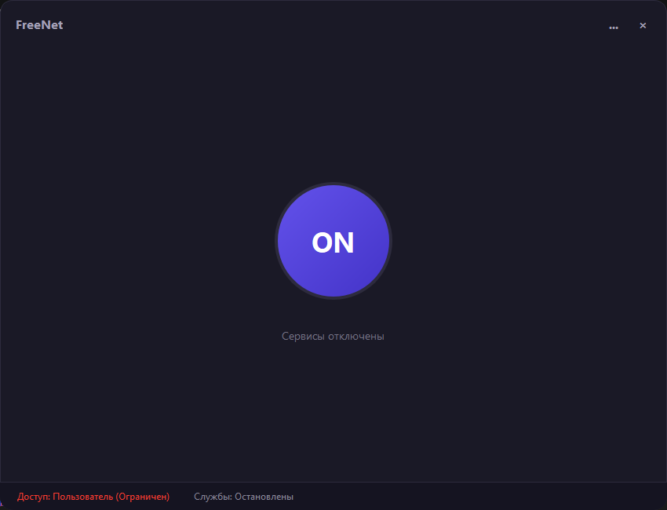

# FreeNet 0.1.0

> Современный графический интерфейс для автоматизации обхода блокировок и управления сетевыми утилитами в Windows.



Автор zapret и tg-ws-proxy - [Flowseal](https://github.com/Flowseal)
База данных хостов - [GeoHideDNS](https://raw.githubusercontent.com/Internet-Helper/GeoHideDNS/refs/heads/main/hosts/hosts)

---

## 📂 Структура проекта


```text
FreeNet/
│
├── assets/                     # Графические ресурсы приложения
├── core/                       # Ядро приложения
│   └── services.py             # Управление процессами, парсинг hosts, запуск cmd
│
├── ui/                         # Графический интерфейс (PySide6)
│   ├── main_window.py          # Главное окно (фрейм, трей, переключатель страниц, UAC)
│   ├── main_page.py            # Центральная страница
│   └── settings_page.py        # Страница настроек и выбора конфигураций (.bat)
│
├── utils/                      # Вспомогательные системные утилиты
│   └── installation.py         # Загрузчик компонентов, распаковка zip-архивов
│
├── .gitignore
├── config.py                   # Глобальные константы
├── main.py                     # Главная точка входа
└── README.md